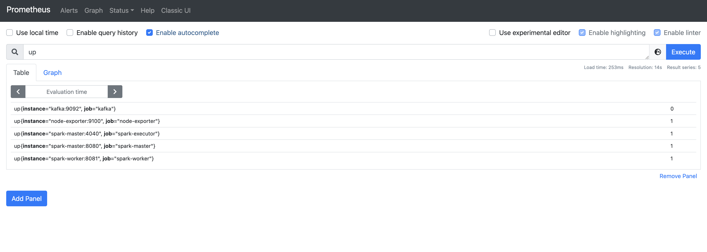
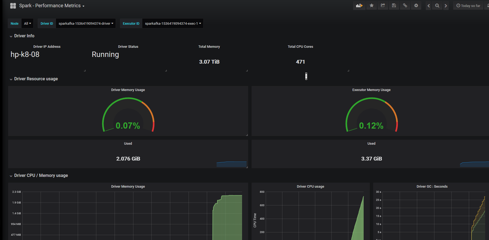

## Metrics Monitoring

This project is monitoring metrics of spark and kafka

### Prerequsite

- Run [Spark](https://github.com/cs6675-spring24-group13/spark) project and [Realtime data analysis](https://github.com/cs6675-spring24-group13/realtime-data-analysis) project.

### Step

- Run docker compose

```
docker compose up -d
```

- Access Prometheus at localhost:9090 and query `up` at the search textbox

The result 1 of each service indicates that the prometheus is successfully connecting and collecting metrics.



- Access Grafana at localhost:3000 and add datasource of Prometheus, add graphs you want.

examples would be as the following but we are still working on it.



